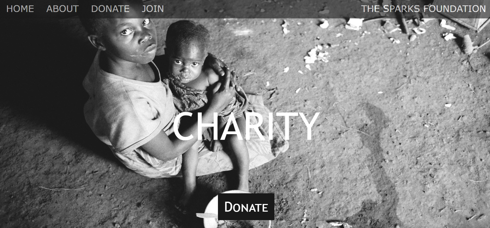

# THE SPARKS FOUNDATION 

 Hi I made this website to integrate payment gateway for <b>The Sparks Foundation</b> Task as Web and Mobile Developer Intern.

<h2 color="green">PAYMENT GATEWAY INTEGRATION</h2>
<li>Create a simple website where payment gateway is integrated. There will be a simple donate button on homepage. On clicking

<li>The donate button, the user will land on the payment page where user can select the amount to be paid and the payment type, e.g. credit card, Paypal, etc</li>
 <li>Once the payment is done and invoice will be generated and email will be sent to the user for the payment received. The invoice will contain the amount.</li>
 <li>On any page / email, only basic information is needed.</li>
 <li>Create your own temporary / sandbox/testing accounts with 3rd party for integrations.</li>
 <li>Host the website at 000webhost, github.io, heroku app or any other free hosting provider. Check in code in gitlab.</li>
  
  
 I hosted this webswite in 000webhost 
<b>Website Link:<b><a href="https://charitywebsitedemogrip2021.000webhostapp.com/">here<a>
<b>Youtube Link:<b><a href="">here<a>
<b>Linkedin Post:<b><a href="">here<a> 
  
    
<h3>FOLLOW:</h3>
<li><a href="https://www.linkedin.com/in/mathu-mitha-0541421b1">LinkedIn</a>
<li><a href="https://www.instagram.com/shruthi_mathu/hik">Instagram</a>
<li><a
href=
"https://youtube.com/channel/UCTrkFigM5wkZGp0kQMxTd3A">YouTube</a>
<li><a href=
"https://twitter.com/v_mathumitha?s=08">Twitter</a>

